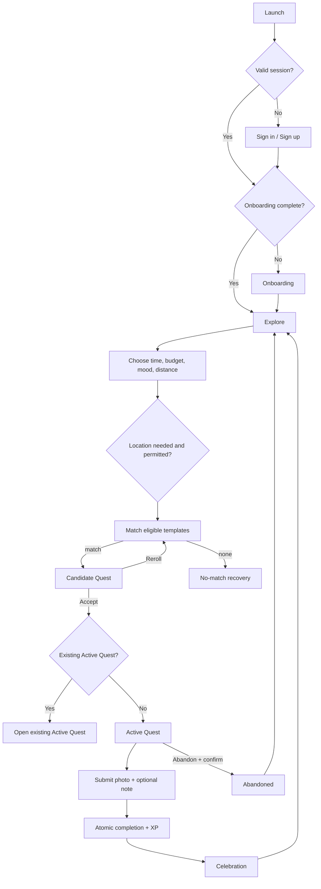

# User Flows

## End-to-end core loop



## First launch, authentication, onboarding

1. Splash restores Supabase session.
2. No valid session routes to Welcome/Auth; valid session routes according to onboarding state.
3. Sign-up validates fields, creates the account, and follows the configured email-verification policy.
4. Onboarding explains the product, captures minimal defaults, requests no OS permission, then saves atomically.
5. Completion routes to Explore. Back navigation must not expose authenticated screens after sign-out.

Recovery: field errors remain inline; unavailable service offers retry; expired session returns to Sign In without deleting server data.

## Discovery, filtering, and matching

1. Explore preselects saved/default filters.
2. User changes four required selectors and taps **Find a Quest**.
3. If distance requires proximity, ask for foreground location at this moment.
4. If granted, obtain a fresh-enough coordinate. If denied/unavailable, exclude `place`; exclude `area` unless the app already knows an eligible area without additional user input; keep `none` eligible. Manual area selection is P1.
5. Server validates filters, applies eligibility/safety/history rules, creates one Candidate Quest Instance, and returns it.
6. Candidate shows why it fits. No-match screen suggests explicit constraint changes; it never expands constraints silently.

## Reroll

1. User taps Reroll.
2. Current candidate becomes `rerolled` with `status_reason=rerolled`. Any `template_id` already represented by an instance with the same `search_id` is excluded from later rerolls.
3. Server returns another eligible candidate or a no-more-results state.
4. Rerolls are rate-limited; the UI shows retry timing on limit.

## Accept and Active Quest

1. Accept calls a server-authoritative transition.
2. A partial unique database constraint prevents a second Active Quest.
3. On conflict, route to the existing Active Quest.
4. Active screen displays instructions, metadata, proof entry, external-map action if applicable, and Abandon.
5. App restart or tab revisit fetches the server Active Quest and any uploaded proof state.
6. An Active Quest has no ordinary duration-based expiry. It may expire only when explicit availability ends (`availability_expired`) or a safety disable invalidates it (`safety_disabled`).

## Proof and completion

```mermaid
sequenceDiagram
  actor U as User
  participant A as Mobile app
  participant S as Supabase Storage
  participant D as PostgreSQL/RPC
  U->>A: Choose/take photo and optional note
  A->>A: Validate type, size, note
  A->>S: Upload to private user/quest path
  S-->>A: Object path
  A->>D: Create proof metadata
  U->>A: Complete Quest
  A->>D: complete_quest(instance, idempotency_key)
  D->>D: Validate ownership/state/proof; insert completion; award XP
  D-->>A: Completion + progress delta
  A-->>U: Celebration
```

If upload or completion fails, keep the Active Quest, show retry, and never optimistically award XP. Duplicate completion requests return the original result.

## Abandon

Tap Abandon → confirmation explains no XP → server changes Active to Abandoned with `status_reason=user_abandoned` → proof metadata, if any, becomes `pending_delete` for explicit Storage cleanup → Explore. Cancel leaves state unchanged.

## Profile, history, and progression

- Profile fetches authoritative progress and category aggregates.
- History is reverse chronological, paginated, and opens a read-only detail.
- Level-up is derived during the same completion transaction. Celebration respects reduced-motion settings.

## Permissions

- Location: pre-permission rationale → OS dialog → granted, denied, or unavailable branch. Denied/unavailable uses the exact `none`/known-`area` fallback above.
- Camera: Image Picker remains available when camera is denied; if neither is available, completion is blocked with Settings guidance.
- Photos: request only on user action and only the access needed by the platform picker.

## Offline/error recovery

- Cached Active Quest and profile summary may be read offline and labeled as possibly stale.
- Search, accept, upload, abandon, and complete require connectivity; actions are not blindly queued.
- On reconnect, refetch server state before retrying mutations.
- Global unexpected errors expose Retry and a support-safe correlation ID, never raw internals.
