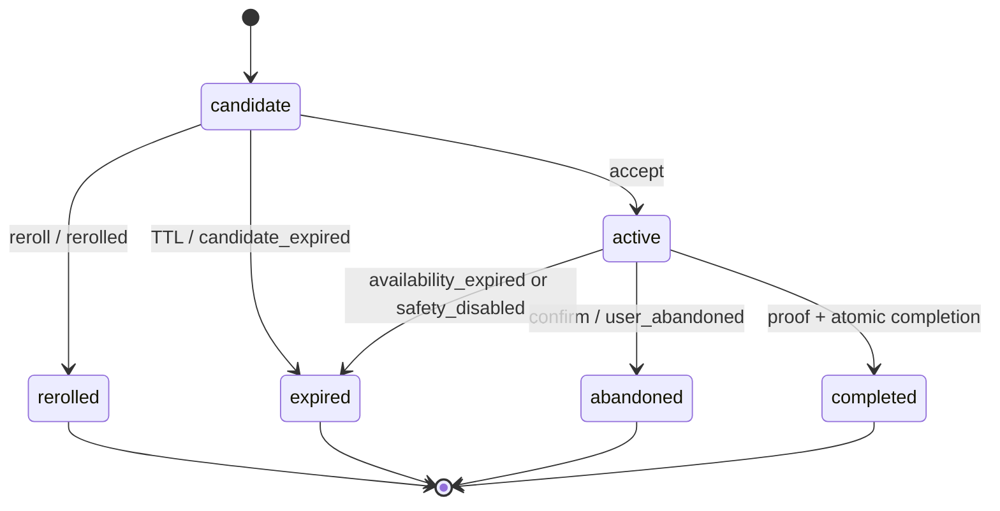

# Quest System

## Domain terms

- **Quest Category:** the seeded `categories` table is authoritative with slugs `chill`, `food`, `explore`, `active`, `creative`. `random` is only a discovery/mood selector and is never a category.
- **Quest Template:** curated reusable definition with eligibility, safety, instructions, base XP, and optional location rules.
- **Quest Instance:** user-specific immutable snapshot generated from one template and one search context.
- **Candidate Quest:** an instance offered but not accepted.
- **Active Quest:** the user’s single accepted instance.
- **Completed Quest:** an instance completed once with valid proof and reward transaction.
- **Abandoned Quest:** an accepted instance explicitly stopped without reward.

## Template model

A template defines title/description/instructions, category, min/max duration, estimated cost, difficulty, base XP, location mode, radius/area eligibility, availability, accessibility/physical-demand text, safety metadata, and enabled/version fields. Templates are curated; user-authored and AI-generated content are excluded.

Location modes:

- `none`: can be done without a venue or current coordinates.
- `area`: requires an eligible controlled launch/discovery `area_code` but not a specific venue.
- `place`: resolves to a curated location record.

## Matching algorithm

1. Validate enum/range inputs and rate limit.
2. Build eligible set: enabled immutable template version; approved by the existing catalog/moderation lifecycle; category match (or all seeded categories for Random); max duration within selected time; `estimated_cost_max` within the selected ceiling; currency `IDR`; availability window valid. A disabled, moderated-out, safety-invalidated, or otherwise unavailable template is ineligible; no separate safety score or taxonomy exists for MVP.
3. For `place`, require fresh-enough foreground coordinates and a currently eligible curated public Location within selected distance. For `area`, require an eligible known `area_code`. When foreground location is unavailable, exclude `place`, exclude `area` unless an eligible area is already known without additional input, and keep `none` eligible. Manual area selection is P1.
4. Exclude the existing Active Quest’s template, templates rerolled in the search session, and templates completed within a configurable cooldown (default 30 days) when alternatives exist.
5. Score only the eligible set. Normalize deterministic time, budget, and location/distance compatibility to `0.0..1.0`, then calculate `score = (time * 0.50) + (budget * 0.30) + (location * 0.20)`. If an integer score is needed, use `round(score * 100)`. Component rules use only the documented time, budget, distance, and location-mode ceilings; they do not add fuzzy categories, personalization, or probabilistic ranking. Add a deterministic hash of user + search request + template only to break equal scores reproducibly.
6. Select the top eligible template/location, snapshot it into a Candidate Instance, and return fit explanations.

Eligibility always runs before scoring and ranking. A high score cannot make an ineligible Quest eligible, and hard constraints are never converted into score penalties.

Budget ceilings: Free = 0 (and requires min/max 0); ≤Rp50,000; ≤Rp100,000. Flexible remains the visible no-user-ceiling preference, but discovery applies an internal MVP consumer-safety ceiling of Rp250,000. This is not a visible tier or new budget category. Matching compares `estimated_cost_max` to the applicable inclusive ceiling. Currency is `IDR` in MVP without conversion/multi-currency UI. Walking distance is locked to an estimated 1 km for MVP; launch research may revisit it later. Half day is 240 minutes.

Availability is evaluated server-side in the Quest location's local wall-clock time. A non-null availability object has the canonical MVP shape `{ "days": [1, 2, 3, 4, 5], "start_time": "09:00", "end_time": "18:00", "valid_from": null, "valid_until": null }`: `days` contains unique ISO weekdays 1 (Monday) through 7 (Sunday), times use `HH:mm`, and optional date bounds use ISO calendar dates. Bounds are inclusive; null bounds add no date restriction. Missing/NULL availability means generally available unless another approved rule disables the Quest. Malformed availability is rejected. The client may display availability but never decides eligibility. MVP does not use RRULE, cron, holiday APIs, or an external calendar provider.

## Reroll and duplicates

- One `quest_searches` row owns every Candidate/Rerolled Instance produced in that search.
- Reroll marks the instance `rerolled`, then re-runs the same constraints.
- Default limit: 10 candidates/search session and 30 search/reroll requests/user/hour; configuration may change operationally.
- Exclude any `template_id` already represented by a `quest_instance` with the same `search_id`; no separate exclusion table is needed. Prefer 30-day novelty across searches, but may repeat recent content only when otherwise no match; label this internally for analytics.
- Concurrency is resolved transactionally; no client-only duplicate prevention.

## Lifecycle

Allowed statuses are `candidate`, `active`, `rerolled`, `completed`, `abandoned`, `expired`. Allowed `status_reason` values are `rerolled`, `candidate_expired`, `user_abandoned`, `availability_expired`, and `safety_disabled`; completion requires no reason. Default Candidate TTL is 30 minutes and is enforced server-side; an expired Candidate cannot be accepted and recovery starts another search. A visible countdown is P1. Active Quests never expire from ordinary duration: they remain Active until completed, abandoned, availability explicitly expires, or safety disable invalidates them. Status timestamps must match terminal/active state.

## Snapshot rules

Each Instance stores `snapshot_version=1` plus immutable JSON containing the exact template row/version, title, description, instructions, category slug, duration, cost and currency, difficulty, XP, physical-demand/safety text, selected Location snapshot when relevant, and audit-relevant search constraints. Template edits never rewrite existing instances.

## Safety rules

Templates MUST NOT require trespass, illegal behavior, interacting with traffic, intoxication, harassment, dangerous heights/water/fire, isolated unsafe areas, purchases above the declared budget, disclosure of private information, photography of people without consent, or access outside known public hours. Active content must describe physical demands and use public, lawful locations. Users are told to stop if conditions feel unsafe. Availability data is advisory; closure reporting is supported operationally/P1 in-app.

## Location versus non-location behavior

`place` Quests use foreground coordinates only for eligibility and snapshot the chosen public Location, not the user’s route. Map actions are generated primarily from latitude, longitude, and location name; a validated optional HTTPS override may be used. `area` uses an `area_code` originating from SideQuest-controlled Quest template/location seed or catalog data; the mobile client cannot submit arbitrary free text. An area Quest can match only an identifier already present in that approved data. `none` has no location dependency. SideQuest does not track arrival or provide turn-by-turn navigation.
