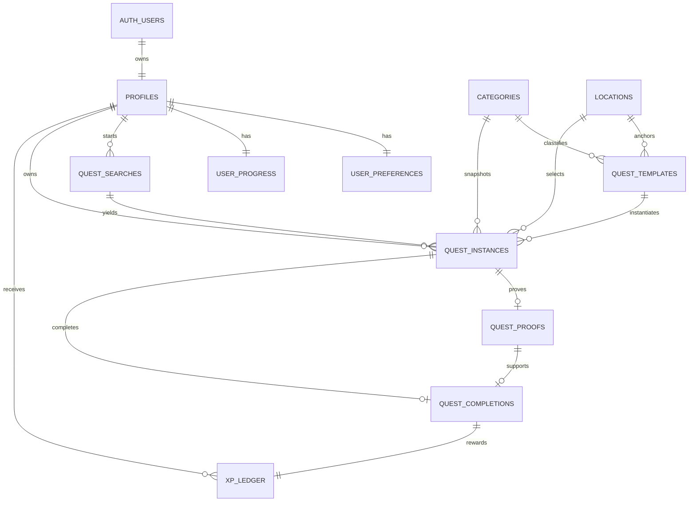

# Data Model

Target: Supabase PostgreSQL. Use `uuid`, `timestamptz`, snake_case, UTC storage, and generated migrations. `auth.users` is Supabase-owned. All mutable tables include `created_at`; add `updated_at` where noted via trigger.

## Enums

`quest_status`: candidate, active, rerolled, completed, abandoned, expired  
`difficulty`: easy, medium, hard  
`location_mode`: none, area, place  
Filter enums/checks use stable machine values for time/budget/distance; labels use localization keys. There is no `quest_category` enum: the seeded `categories` table is authoritative.

## Tables

### `profiles`

One-to-one public identity/private ownership root.

| Field | Type | Rules |
|---|---|---|
| user_id | uuid | PK, FK `auth.users(id)` ON DELETE CASCADE |
| display_name | text | NOT NULL, trimmed, 2–40 chars |
| avatar_path | text | nullable; owner-scoped storage path |
| onboarding_completed_at | timestamptz | nullable |
| created_at / updated_at | timestamptz | NOT NULL default now() |

### `user_preferences`

| Field | Type | Rules |
|---|---|---|
| user_id | uuid | PK/FK profiles ON DELETE CASCADE |
| default_time | text | NOT NULL, enum/check; new-account bootstrap defaults to `flexible` |
| default_budget | text | NOT NULL, enum/check; new-account bootstrap defaults to `flexible` |
| default_mood | text | NOT NULL; includes `random` selector, used by bootstrap as a neutral default |
| default_distance | text | NOT NULL, enum/check; new-account bootstrap defaults to `flexible` |
| theme | text | NOT NULL default `system`, check system/light/dark |
| created_at / updated_at | timestamptz | NOT NULL |

### `categories`

Seeded taxonomy for display/configuration. `id smallint` PK, `slug text` UNIQUE, `name_key text`, `is_enabled boolean`, timestamps. Seed exactly `chill`, `food`, `explore`, `active`, and `creative`. Template/Instance category fields reference this table. Never seed `random`; it exists only in discovery preferences/requests.

### `locations`

Specific curated public places only; never geographic-area records or a user tracking log. `area_code` is a controlled launch/discovery-area identifier kept simple for MVP.

| Field | Type | Rules |
|---|---|---|
| id | uuid | PK |
| name | text | NOT NULL |
| area_code | text | NOT NULL |
| latitude / longitude | double precision | nullable together; range checks |
| address | text | nullable |
| external_map_url | text | nullable, validated HTTPS override/fallback; not primary map source |
| timezone | text | NOT NULL IANA zone |
| availability_json | jsonb | nullable, validated structure |
| is_enabled | boolean | NOT NULL default true |
| created_at / updated_at | timestamptz | NOT NULL |

Index: `area_code, is_enabled`; spatial extension/index is optional only when needed by catalog size. MVP can use server-side Haversine with bounded candidate set.

### `quest_templates`

| Field | Type | Rules |
|---|---|---|
| id | uuid | PK; immutable version-row identifier |
| template_family_id | uuid | NOT NULL |
| version | integer | NOT NULL ≥1; UNIQUE(template_family_id, version) |
| category_id | smallint | FK categories |
| title / description | text | NOT NULL, length checks |
| instructions | jsonb | NOT NULL array of 1–10 bounded strings |
| duration_min / duration_max | integer | NOT NULL; 1–480; min≤max |
| estimated_cost_min / estimated_cost_max | integer | NOT NULL default 0; 0≤min≤max; Free requires both 0 |
| currency_code | char(3) | NOT NULL; check `IDR` for MVP |
| difficulty | difficulty | NOT NULL |
| base_xp | integer | NOT NULL check 50–200 |
| location_mode | location_mode | NOT NULL |
| area_codes | text[] | nullable; every value must come from the controlled area-code catalog/configuration |
| location_id | uuid | nullable FK locations; required only for `place` |
| physical_demand / safety_notes | text | NOT NULL |
| availability_json | jsonb | nullable |
| moderation_status | text | NOT NULL check approved/draft/disabled |
| priority | smallint | NOT NULL default 0 |
| enabled_at / disabled_at | timestamptz | nullable |
| created_at / updated_at | timestamptz | NOT NULL |

Each content version is a new immutable row. Never update historical version content in place. `id` is the sole primary key; `(template_family_id, version)` is unique. Quest Instances reference the exact row through `template_id`. No composite primary key is used.

Indexes: approved/enabled/category; location; GIN area_codes only if query evidence supports it.

### `quest_searches`

Auditable/rate-limited search session. `id uuid` PK; `user_id` FK; normalized filter values; `area_code` nullable; coarse matching cell nullable (never raw coordinate); `result_reason text` nullable; `created_at`, `expires_at`. One search owns all Candidate/Rerolled Instances produced by initial match and rerolls. Subsequent rerolls exclude every `template_id` already present under the same `search_id`; no exclusion table exists. Index `(user_id, created_at desc)`.

### `quest_instances`

| Field | Type | Rules |
|---|---|---|
| id | uuid | PK |
| user_id | uuid | FK profiles ON DELETE CASCADE |
| search_id | uuid | FK quest_searches |
| template_id | uuid | FK exact immutable template row |
| status | quest_status | NOT NULL |
| status_reason | text | nullable; check allowed transition reasons |
| snapshot_version | smallint | NOT NULL default 1, check >0 |
| snapshot | jsonb | NOT NULL, immutable schema-versioned execution data |
| category_id | smallint | FK categories, denormalized snapshot key |
| base_xp | integer | NOT NULL check 50–200 |
| location_id | uuid | nullable FK locations |
| candidate_expires_at | timestamptz | nullable |
| accepted_at / completed_at / abandoned_at / expired_at | timestamptz | nullable |
| created_at / updated_at | timestamptz | NOT NULL |

Allowed `status_reason`: `rerolled`, `candidate_expired`, `user_abandoned`, `availability_expired`, `safety_disabled`. Completed needs no reason. Server RPCs own transitions. Use straightforward consistency checks/triggers: Active requires `accepted_at`; Completed requires `completed_at`; Abandoned requires `abandoned_at`; Expired requires `expired_at`. Do not encode the entire state machine as complex checks.

The snapshot includes exact template family/version/row, title, description, instructions, category, duration, cost, currency, difficulty, XP, safety/physical-demand text, selected Location data when relevant, and audit-relevant search constraints. Template changes never rewrite it.

Mandatory index:

```sql
CREATE UNIQUE INDEX one_active_quest_per_user
ON quest_instances(user_id)
WHERE status = 'active';
```

Other indexes: `(user_id, created_at desc)`, `(search_id, status)`, `(template_id, user_id, created_at desc)`.

### `quest_proofs`

`id uuid` PK; `quest_instance_id uuid` FK UNIQUE (at most one current proof); `user_id uuid` FK; `storage_path text` UNIQUE NOT NULL; `mime_type text`; `byte_size integer`; `note text` nullable check ≤500; `status text` check uploaded/pending_delete; `created_at/updated_at`. A proof may exist while its Quest is Active. Validate `user_id` equals instance owner in a privileged function/trigger. Replacing/abandoning marks metadata `pending_delete`; an explicit worker deletes the Storage object first and then may delete metadata. Database deletion alone never implies Storage deletion. Index user/time.

### `quest_completions`

Immutable record: `id uuid` PK; `quest_instance_id uuid` UNIQUE FK; `user_id uuid` FK; `proof_id uuid` UNIQUE FK; `xp_awarded integer` NOT NULL; `level_before/after integer`; `idempotency_key uuid`; `completed_at timestamptz`; UNIQUE `(user_id, idempotency_key)`. Replaying the same request returns the existing result. Concurrent different keys for one Instance are resolved by unique `quest_instance_id`. Index history `(user_id, completed_at desc)` and compute category statistics through completed history.

### `user_progress`

`user_id uuid` PK/FK; `lifetime_xp bigint` NOT NULL default 0 check ≥0; `level integer` NOT NULL default 1; `completed_count integer` NOT NULL default 0; `updated_at`. This is a transactional cached aggregate, updated only inside the completion transaction and rebuildable from authoritative completions/ledger. No category-statistics table is created.

### `xp_ledger`

Immutable audit: `id uuid` PK; `user_id`; `quest_completion_id` UNIQUE NOT NULL; `amount integer`; `reason text` constrained to `quest_completion` for MVP; `created_at`. Exactly one completion produces exactly one ledger row containing the total award, including any approved bonus. Sum is auditable against progress.

## ER diagram



## Decisions

- Quest snapshots prevent content edits from changing accepted work.
- Template version rows and Quest Instance snapshots are immutable.
- `quest_completions` proves completion, `xp_ledger` audits one total award per completion, and `user_progress` is a transactional cached aggregate.
- Partial unique index is the final one-Active guarantee.
- Exact coordinates are not stored in searches; chosen public Quest locations are legitimate content data.
- Category aggregates are computed initially; add materialized counters only after measurement.
- Development/test fixtures are deterministic and independent from mutable production-style catalog seeds.
- All client-visible tables use RLS; catalog reads expose approved/enabled rows only through a safe view/RPC.
