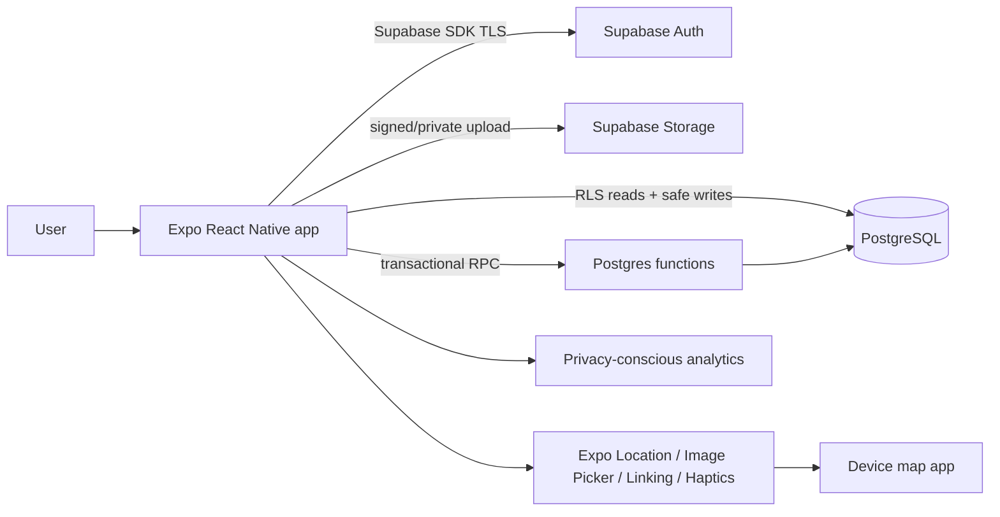
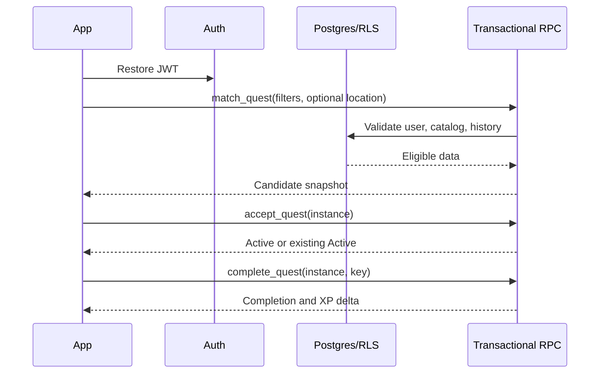

# Technical Architecture

## System overview

## Mobile architecture

- Expo Router route groups: `(auth)`, `(onboarding)`, `(tabs)`, and modal/detail routes.
- TypeScript strict mode; feature folders (`auth`, `discovery`, `quests`, `progress`, `profile`) with UI, hooks, schemas, and tests.
- Server state: TanStack Query is recommended for caching, deduplication, invalidation, and offline read behavior. Local ephemeral UI state uses React state; a small Zustand store is permitted only if cross-route transient discovery state warrants it.
- Validation: shared Zod schemas for client boundaries; database constraints remain authoritative.
- Business rules (filter conversion, level math, view models) live outside components. Server-only matching/reward rules live in SQL functions or a thin Edge Function.
- NativeWind expresses tokens; accessible base components centralize states and hit targets.
- All user-facing strings resolve through localization keys. Locale defaults to `id-ID` and falls back to `en`; business logic never depends on translated copy.

## Backend architecture

One Supabase project per environment supplies Auth, PostgreSQL, Storage, RLS, database functions, and migrations. No microservices. Prefer SQL RPC for transactional accept/abandon/complete operations. Use an Edge Function only if hiding a third-party secret or orchestration cannot be safely expressed in SQL.

## Authentication and authorization

Supabase Auth manages tokens; secure platform storage uses Expo SecureStore where the SDK configuration requires explicit persistence. Route guards are UX only—RLS and privileged functions enforce ownership. Never ship service-role keys.

## Data and caching

- Query keys include user and resource identifiers; clear protected cache on sign-out.
- Persist only minimal safe cache: Active snapshot and profile summary; do not persist raw coordinates, proof bytes, tokens in AsyncStorage, or signed URLs.
- Refetch Active Quest on foreground, reconnect, acceptance/completion, and Quests-tab focus.
- Paginate history by stable `(completed_at,id)` cursor.

## Offline model

MVP is online-required for authoritative actions. Cached Active Quest is readable offline. Do not enqueue completion/abandon automatically because stale state can cause ambiguous rewards. Proof may retain a temporary local URI during the current session; OS cleanup may invalidate it, so explain re-selection when needed.

## Location and media

Request foreground location at search time, use a bounded freshness/accuracy policy, transmit over TLS to matching, and discard afterward. Without it, only `none` and an `area` with already-known eligible context may match; never return `place`. Use Expo ImagePicker/Camera, normalize metadata/orientation, strip unnecessary EXIF when feasible, compress to configured size, then upload exactly one private image. Open directions via Expo Linking using latitude, longitude, and location name; an allowlisted HTTPS override is optional.

## Error handling and logging

Define typed domain errors (`NO_MATCH`, `ACTIVE_EXISTS`, `CANDIDATE_EXPIRED`, `PROOF_REQUIRED`, `RATE_LIMITED`, `SESSION_EXPIRED`, `NETWORK`). Map them to actionable copy. Structured logs include environment, app version, operation, correlation ID, and safe identifiers; exclude secrets, raw coordinates, notes, and image paths where unnecessary. Third-party crash reporting is deferred post-MVP under OQ-004.

## Environment configuration

Commit `.env.example`, never `.env`; expose only public Supabase URL/anon key and non-secret flags via Expo public config. Store service secrets in Supabase/CI secret stores. Environments: local, staging, production with separate databases/buckets/analytics. Migrations are forward-only, reviewed, and tested from empty state.

## Required Expo capabilities

Required: Location (foreground), Image Picker, Camera, Linking, and SecureStore. Haptics is a nonessential enhancement. Notifications are P2 and excluded from base permissions/configuration. Camera denial must not prevent use of the system picker.
